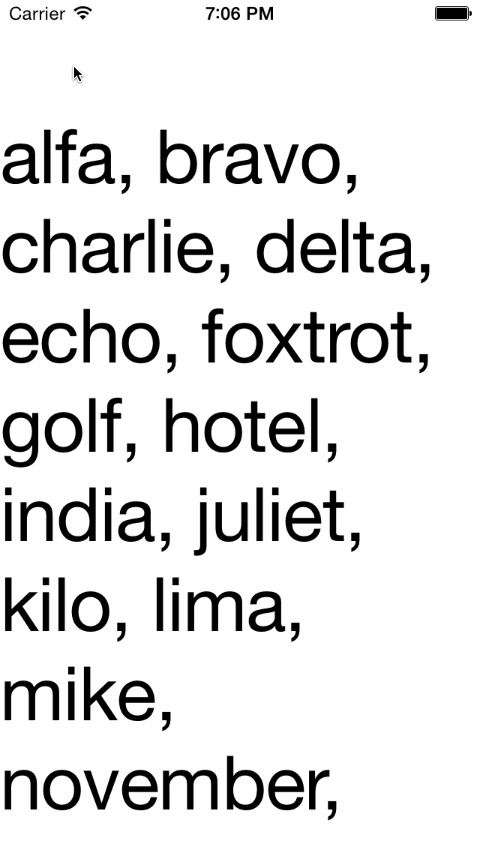

#KeyboardAdjustViewController

[English version of README](#englishreadme)

在键盘弹出的时候自动调整布局来适应键盘，有以下几种形式：

* KeyboardAdjustNone  (不做任何变化)

* KeyboardAdjustAlignBottom (键盘弹出的时候把view滑动到键盘顶部)

* KeyboardAdjustScaling (键盘弹出的时候把view缩小到键盘以外的剩余空间内)

* KeyboardAdjustScrolling (键盘弹出的时候让view可以自由滚动)

Automatically adjust UIViewController's view for keyboard, with different style show as follow:

* KeyboardAdjustNone (don't change anything)

* KeyboardAdjustAlignBottom (push view to the top of the keyboard)

* KeyboardAdjustScaling (scale view to fit the remain space after keyboard pop up)
* KeyboardAdjustScrolling (make view scrollable when keyboard shows)

